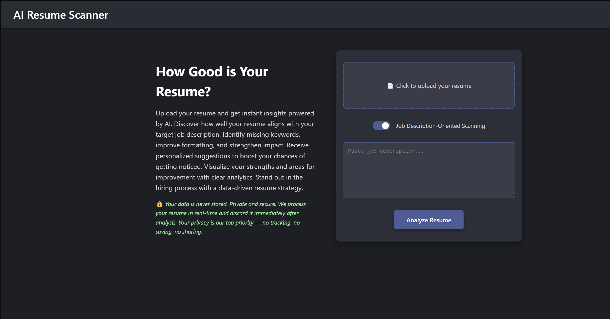
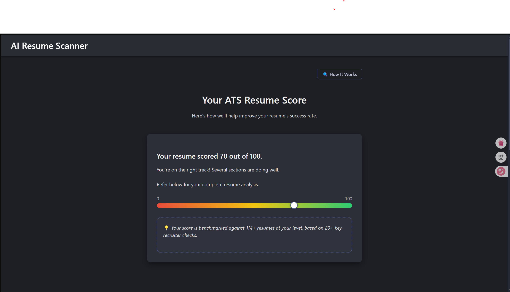
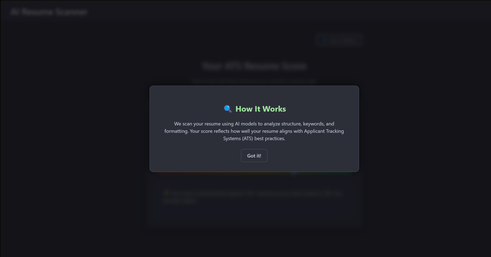
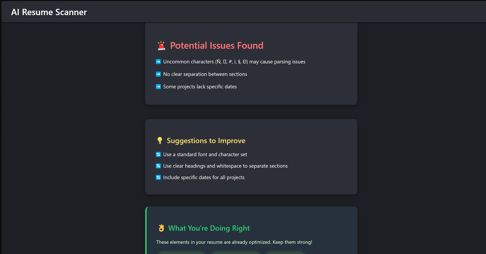

# 🚀 AI Resume Screener

An AI-powered resume analyzer that evaluates your resume using semantic similarity and ATS-style keyword matching. Instantly get job-specific insights, suggestions, and a match score.

---

## 🔗 Live Demo

👉 [Try the Live App](https://resume-screener-three.vercel.app)

---

## 🧠 How It Works

1. Upload your resume (PDF only).
2. (Optional) Paste a job description for JD-based analysis.
3. The system:
   - Uses **SBERT** (Python) for semantic similarity scoring.
   - Extracts keyword matches using **Node.js** backend.
4. Displays a beautiful dashboard with:
   - ATS-style score
   - Summary & suggestions
   - Visual keyword breakdown
   - Highlighted resume strengths

---

## ✨ Features

- ✅ ATS Resume Compatibility Score
- 🤖 AI-Generated Feedback & Suggestions
- 📚 Keyword Matching (Matched / Missing)
- 🎯 Job Description Matching (Optional)
- 📊 Animated Dashboard with Visual Tags
- 🌙 Dark Mode UI

---

## 🖼 Screenshots

### 📝 Home Page

### 📊 ATS Result

### 🤝 How It Works

### 📄 Report

---

## 🛠 Tech Stack

| Layer       | Technology         |
|-------------|--------------------|
| Frontend    | React.js           |
| Backend     | Node.js + Express  |
| AI Scoring  | Python + SBERT     |
| Styling     | Custom CSS         |
| Hosting     | Vercel + Railway   |

---

## 🔒 Privacy & Security

- 🔒 **Your resume and job description are never stored.**
- ✅ **Data is processed only in memory and discarded immediately.**
- 🔐 **Secure proxy backend prevents API key exposure.**

## 🧑‍💻 Author

**Krishna Mewara**  
🎓 NIT Silchar &nbsp;&nbsp;|&nbsp;&nbsp; 💻 Full Stack Developer  
📧 krishnamewara314@gmail.com  
🌐 [LinkedIn](https://www.linkedin.com/in/krishna-mewara-127699280) • [GitHub](https://github.com/DeathGun44)

